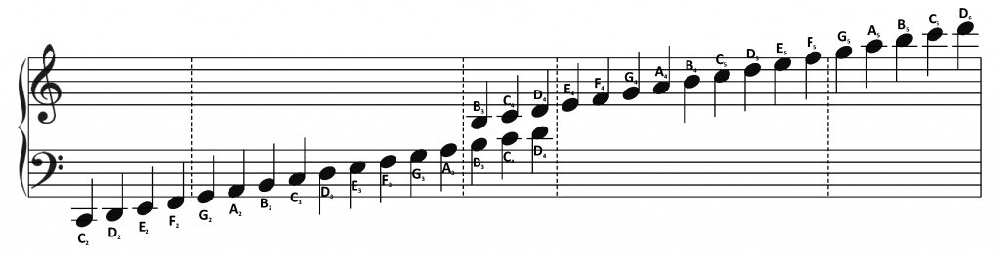

[Home](index.md){: .btn}

### Class Resources

##### Musescore

Musescore provides a wide range of sheet music for different 
songs, which can be used for creating tunes on the arduino.

[Musescore](https://musescore.com/sheetmusic)

##### Sheet Music - Free

Sheet Music Free is another website which provides a large selection of 
free sheet music. 

[Sheet Music - Free](https://sheetmusic-free.com/)

###### Sheet to Letter Conversion Diagram

In case you forget while covering it in class.

